<!--
  github.com/CapedCrusader77 - profile readme
  Neural Control Lab interface architecture
-->

  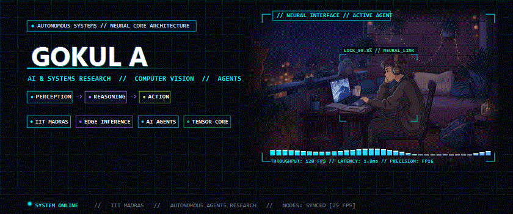

  <code>[ NEURAL CORE: ONLINE ]</code> &nbsp;•&nbsp;
  <code>[ ROS 2 // ACTIVE ]</code> &nbsp;•&nbsp;
  <code>[ EDGE INFERENCE: 3.2ms ]</code> &nbsp;•&nbsp;
  <code>[ CUDA 12.4 ]</code> &nbsp;•&nbsp;
  <code>[ BUILD 077 ]</code>

  <strong>"Building machines that can perceive, reason, and act."</strong>

 

<!-- selected work -->

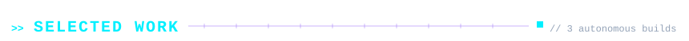

  <a href="https://github.com/CapedCrusader77/sensor-fusion-slam"></a>

  <a href="https://github.com/CapedCrusader77/edge-tensor-vision"></a>

  <a href="https://github.com/CapedCrusader77/autonomous-policy-mpc"></a>

<!-- telemetry (live) -->

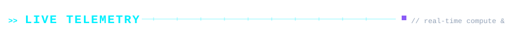

  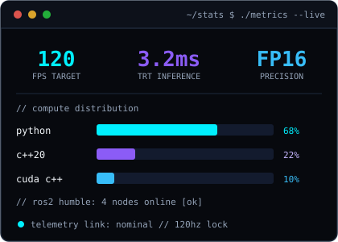
  &nbsp;
  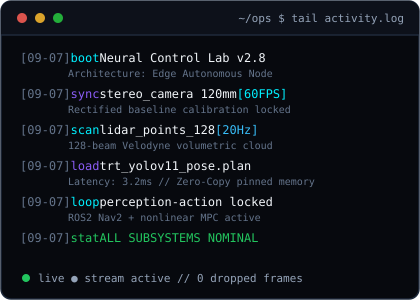

<!-- loadout / stack -->

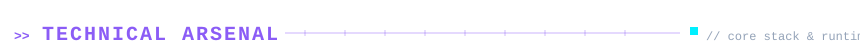

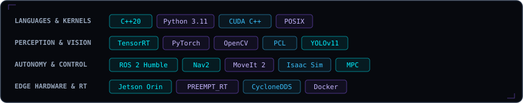

<!-- whois / reach -->

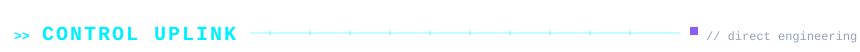

  
  &nbsp;
  
  &nbsp;
  
  &nbsp;
  

 

  <i>"The best way to predict the future is to build it."</i>

