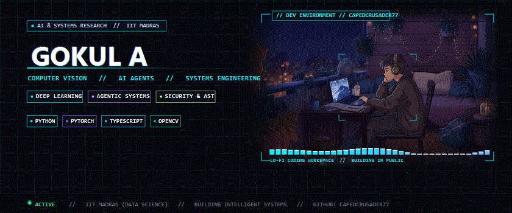

<div align="center">

  

  <br /><br />

  <code>[ NEURAL CORE: ONLINE ]</code> &nbsp;•&nbsp;
  <code>[ ROS 2 // ACTIVE ]</code> &nbsp;•&nbsp;
  <code>[ EDGE INFERENCE: 3.2ms ]</code> &nbsp;•&nbsp;
  <code>[ CUDA 12.4 ]</code> &nbsp;•&nbsp;
  <code>[ BUILD 077 ]</code>

  <br /><br />

  <strong>"Building machines that can perceive, reason, and act."</strong>

</div>

---

### 📡 SENSOR-TO-ACTION PARADIGM

```
  [ 01 // SENSOR PERCEPTION ]          [ 02 // NEURAL REASONING ]          [ 03 // PHYSICAL ACTION ]
  Stereo Vision · LiDAR · IMU   ───►   World Models · Deep RL       ───►   ROS 2 · Real-Time MPC
  PCL · 6-DoF Pose · YOLOv11           TensorRT · CUDA · ONNX              Nav2 · MoveIt 2 · C++20
```

> **Mission**: Engineering deterministic, safety-critical autonomous systems that bridge deep neural perception with real-time robotic actuation on edge hardware.

---

### ⚡ SELECTED BUILDS // ACTIVE LOADOUT

<table>
  <tr>
    <td width="33%" valign="top">
      <div align="center">
        <h3><code>01 // SLAM_CORE</code></h3>
        <sub><b>LiDAR-Visual Spatial Odometry</b></sub>
      </div>
      <br />
      Multi-modal SLAM fusing stereo optical flow with 3D LiDAR point clouds for GPS-denied autonomous navigation and volumetric mapping.
      <br /><br />
      <b>Core Stack:</b> <code>ROS 2</code> <code>C++20</code> <code>PCL</code> <code>Nav2</code><br />
      <b>Status:</b> <code>● ONLINE (Zero-Drift)</code>
    </td>
    <td width="33%" valign="top">
      <div align="center">
        <h3><code>02 // EDGE_VISION</code></h3>
        <sub><b>Zero-Copy Inference Pipeline</b></sub>
      </div>
      <br />
      Hardware-accelerated perception engine for 3D object detection, 6-DoF pose estimation, and depth segmentation at 120 FPS.
      <br /><br />
      <b>Core Stack:</b> <code>PyTorch</code> <code>TensorRT</code> <code>CUDA</code> <code>VPI</code><br />
      <b>Status:</b> <code>● ACTIVE (3.2ms Latency)</code>
    </td>
    <td width="33%" valign="top">
      <div align="center">
        <h3><code>03 // POLICY_MPC</code></h3>
        <sub><b>Reinforcement Learning Planner</b></sub>
      </div>
      <br />
      Deep reinforcement learning policy network paired with nonlinear Model Predictive Control for dynamic obstacle avoidance.
      <br /><br />
      <b>Core Stack:</b> <code>Python</code> <code>Isaac Sim</code> <code>MPC</code> <code>ROS 2</code><br />
      <b>Status:</b> <code>◐ TRAINING (Sim2Real)</code>
    </td>
  </tr>
</table>

---

### 📝 FIELD NOTES // RESEARCH & LOGS

- `[EDGE AI]` **Sub-4ms Perception on Jetson Orin** · Zero-copy IPC, unified memory optimization, and TensorRT FP16 quantization.
- `[SENSOR FUSION]` **Extrinsic Calibration of Stereo & LiDAR** · Spatial alignment, timestamp synchronization, and ray-casting projection.
- `[ROS 2 ARCHITECTURE]` **Deterministic Real-Time Pipelines** · Profiling intra-process zero-copy transport on CycloneDDS and PREEMPT_RT.
- `[WORLD MODELS]` **Latent Spatial Prediction for Autonomy** · Self-supervised state estimation for robot navigation in dynamic scenes.

---

### 📊 SYSTEM TELEMETRY // LIVE METRICS

```bash
# ~/telemetry $ ./system_metrics --live
[COMPUTE DISTRIBUTION]
Python 3.11+   ████████████████████░░░░░░░░  68%  [Deep Learning / Tensor Pipelines]
C++20          ██████████░░░░░░░░░░░░░░░░░░  22%  [ROS 2 Nodes / Real-Time Control]
CUDA C++       ████░░░░░░░░░░░░░░░░░░░░░░░░  10%  [Kernel Optimization / GPU Memory]

[SUBSYSTEM INTEGRITY]
Autonomous Systems    [████████████████████] 100%  :: LOCKED
Computer Vision       [██████████████████░░]  92%  :: CALIBRATED
Deep RL & Planning    [████████████████░░░░]  80%  :: CONVERGING
Hardware Acceleration [██████████████░░░░░░]  70%  :: OPTIMIZED
```

```bash
# ~/ops $ tail -f telemetry.log
[BOOT] System: Neural Control Lab v2.8.4
[SYNC] Stereo camera: 120mm baseline @ 1080p60 [SYNC_OK]
[SYNC] LiDAR: 128-beam Velodyne sensor stream [ACTIVE]
[CUDA] Allocated device memory: 4.8 GB // Unified memory active
[TRT]  Loaded engine: yolov11_perception.plan (FP16 optimized)
[PERC] Inference latency: 3.2ms (Zero-Copy pinned buffers)
[ROS2] Active nodes: /camera /lidar /fusion /policy /nav2
[STAT] Perception-Action loop locked: ZERO_DROPPED_FRAMES
[STAT] All engineering subsystems: NOMINAL
```

---

### 🛠️ TECHNICAL ARSENAL

<table>
  <tr>
    <td width="25%" valign="top">
      <b>Languages & Low-Level</b><br />
      • <code>C++20 / C++17</code><br />
      • <code>Python 3.11+</code><br />
      • <code>CUDA C++</code><br />
      • <code>POSIX Shell / Bash</code>
    </td>
    <td width="25%" valign="top">
      <b>AI & Deep Learning</b><br />
      • <code>PyTorch / LibTorch</code><br />
      • <code>TensorRT Optimization</code><br />
      • <code>ONNX Runtime</code><br />
      • <code>Deep RL (PPO / SAC)</code>
    </td>
    <td width="25%" valign="top">
      <b>Robotics & Control</b><br />
      • <code>ROS / ROS 2 (Humble)</code><br />
      • <code>Nav2 (Path Planning)</code><br />
      • <code>MoveIt 2 (Manipulation)</code><br />
      • <code>Isaac Sim & Gazebo</code>
    </td>
    <td width="25%" valign="top">
      <b>Vision & SLAM</b><br />
      • <code>OpenCV & VPI</code><br />
      • <code>Point Cloud Lib (PCL)</code><br />
      • <code>ORB-SLAM3 / RTAB-Map</code><br />
      • <code>Multi-Camera Calibration</code>
    </td>
  </tr>
</table>

---

### 🌐 CONTROL UPLINK & CONNECT

<div align="center">

```
  CAPEDCRUSADER77 // NEURAL CONTROL LAB
  Engineer: Gokul A
  Affiliation: Indian Institute of Technology Madras (IIT Madras)
  Focus: Autonomous Robotics · Computer Vision · Edge AI
```

<a href="https://github.com/CapedCrusader77"></a>
<a href="https://www.linkedin.com/in/gokul-a-2726a4391/"></a>
<a href="mailto:25f2008464@ds.study.iitm.ac.in"></a>
<a href="https://github.com/CapedCrusader77"></a>

<br /><br />

<i>"The best way to predict the future is to build it."</i>

</div>
